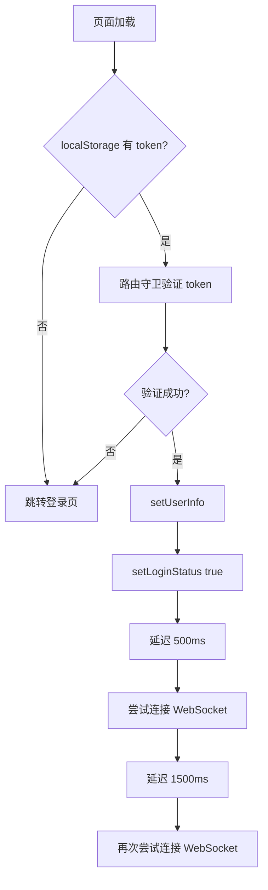

# 登录会话管理与通知增强说明文档

## 📋 概述

本文档说明了项目的登录会话管理机制、WebSocket 通知重连优化以及登录成功提示的增强功能。

---

## 1️⃣ 登录持久化管理机制

### 🔑 核心机制

系统使用 **`localStorage`** 作为登录持久化存储方案。

**特点**：

- ✅ 完全支持多标签页共享登录状态
- ✅ 可以在新标签页打开链接时保持登录
- ✅ 关闭浏览器后重新打开仍保持登录（便于快速恢复工作）
- ✅ 配合后端 Redis Token 白名单机制，确保安全性

### 📍 实现位置

**文件**: `src/store/modules/user.ts`

### 🔍 工作原理

#### 1.1 Token 存储（登录时）

```typescript:431:445:src/store/modules/user.ts
// 设置Token
const setToken = (newToken: string, refreshToken?: string) => {
  // 保存原始的token，不添加Bearer前缀（由HTTP客户端处理）
  token.value = newToken
  // 使用 localStorage 支持多标签页共享
  // 配合后端 Redis Token 白名单实现安全的会话管理
  localStorage.setItem('token', newToken)
  if (refreshToken) {
    localStorage.setItem('refreshToken', refreshToken)
  }

  // 设置token后立即设置登录状态为true
  isLogin.value = true

  console.log('🔑 [UserStore] Token已设置到 localStorage:', { token: newToken ? 'exists' : 'empty', isLogin: isLogin.value })
}
```

#### 1.2 Token 恢复（页面刷新/重新打开浏览器）

```typescript:20:33:src/store/modules/user.ts
// 初始化恢复登录状态
const initLoginState = () => {
  // 优先从 localStorage 读取（支持多标签页共享）
  const savedToken = localStorage.getItem('token') || sessionStorage.getItem('token')
  if (savedToken) {
    token.value = savedToken
    // 如果是从 sessionStorage 迁移，同步到 localStorage
    if (!localStorage.getItem('token') && sessionStorage.getItem('token')) {
      localStorage.setItem('token', savedToken)
      sessionStorage.removeItem('token')
    }
    // 不直接标记已登录，交由路由守卫通过 /auth/me 校验后再设为 true，避免"伪登录"状态
    console.log('🔑 [UserStore] 从 localStorage 恢复 token，待校验')
  }
}
```

#### 1.3 Token 验证（路由守卫）

**文件**: `src/router/guards/beforeEach.ts`

```typescript:185:218:src/router/guards/beforeEach.ts
// 如果有token但登录状态为false，尝试验证token有效性
if (!userStore.isLogin) {
  try {
    console.log('🔐 [RouteGuard] 验证token有效性')
    const userInfo = await UserService.getUserInfo()
    userStore.setUserInfo(userInfo)
    // 仅在后端成功返回 /auth/me 后，才标记为登录
    userStore.setLoginStatus(true)
    console.log('✅ [RouteGuard] Token验证成功，恢复登录状态')

    // 确保 WebSocket 连接建立（延迟重试机制，提高连接成功率）
    setTimeout(() => {
      console.log('🔔 [RouteGuard] 尝试建立 WebSocket 连接（延迟500ms）')
      userStore.connectNotifyWS()
    }, 500)

    // 再次尝试（双重保险）
    setTimeout(() => {
      console.log('🔔 [RouteGuard] 再次尝试建立 WebSocket 连接（延迟1500ms）')
      userStore.connectNotifyWS()
    }, 1500)

    return true
  } catch (error) {
    console.error('❌ [RouteGuard] Token验证失败:', error)
    // Token无效，清除并跳转到登录页
    userStore.logOut()
    next(RoutesAlias.Login)
    return false
  }
}
```

### ✨ 特点

| 特性             | 说明                                                  |
| ---------------- | ----------------------------------------------------- |
| **多标签页共享** | 所有标签页完全共享登录状态                            |
| **持久化**       | 关闭浏览器后重新打开仍保持登录状态                    |
| **安全性**       | Token 由后端 Redis 白名单管理，确保安全               |
| **自动校验**     | 每次页面加载时通过 `/auth/me` API 验证 Token 有效性   |
| **兼容性**       | 支持从旧版 `sessionStorage` 自动迁移到 `localStorage` |

---

## 2️⃣ WebSocket 通知重连优化

### ❌ 之前的问题

关闭浏览器后重新打开，虽然自动登录成功，但 **收不到新任务提交的通知**。

### ✅ 解决方案

在路由守卫恢复登录状态时，**增加延迟重试机制**，确保 WebSocket 连接能够稳定建立。

### 📍 实现位置

**文件**: `src/router/guards/beforeEach.ts`（第195-205行）

### 🔧 优化内容

1. **延迟连接**：在 Token 验证成功后 500ms 尝试连接（避免过快导致服务端未准备好）
2. **双重保险**：在 1500ms 时再次尝试连接（提高连接成功率）
3. **导出方法**：将 `connectNotifyWS` 方法从 `userStore` 导出，便于外部调用

### 🔄 连接流程



### 📝 日志输出

```
🔐 [RouteGuard] 验证token有效性
✅ [RouteGuard] Token验证成功，恢复登录状态
🔔 [RouteGuard] 尝试建立 WebSocket 连接（延迟500ms）
🔔 [WS] 准备连接，角色信息: {...}
🔔 [WS] 通知连接已建立: ws://...
🔔 [RouteGuard] 再次尝试建立 WebSocket 连接（延迟1500ms）
```

---

## 3️⃣ 登录成功提示增强

### 🎯 需求

- **标注员登录时**，显示：
  - 当前进行中的任务数量
  - 被驳回的任务数量（如有），并重点提示"建议请您先修订"

### 📍 实现位置

**文件**: `src/views/auth/login/index.vue`

### 🔧 实现逻辑

```typescript:233:291:src/views/auth/login/index.vue
// 登录成功提示
const showLoginSuccessNotice = async () => {
  setTimeout(async () => {
    const info: any = userStore.getUserInfo
    const displayName = info?.realName || info?.userName || info?.username || ''
    const userRole = (info?.role || '').toLowerCase()

    // 基础欢迎消息
    let message = `欢迎回来，${displayName}`
    let rejectedCount = 0 // 初始化在外部作用域

    // 为标注员添加任务统计信息
    if (userRole === 'annotator' || (Array.isArray(info?.roles) && info.roles.includes('R_ANNOTATOR'))) {
      try {
        // 获取当前用户的任务列表
        const userId = info?.id || info?.userId
        if (userId) {
          const tasksResult: any = await taskApi.getTasks({
            assignedTo: userId,
            page: 1,
            pageSize: 100 // 获取所有任务进行统计
          })

          const tasks = tasksResult?.data?.list || tasksResult?.list || []

          // 统计进行中的任务
          const inProgressCount = tasks.filter((t: any) => t.status === 'in_progress').length

          // 统计被驳回的任务
          rejectedCount = tasks.filter((t: any) => t.status === 'rejected').length

          // 构建消息
          const taskInfo: string[] = []
          if (inProgressCount > 0) {
            taskInfo.push(`当前有 ${inProgressCount} 个任务进行中`)
          }
          if (rejectedCount > 0) {
            taskInfo.push(`⚠️ 您有 ${rejectedCount} 个被驳回任务，建议请您先修订`)
          }

          if (taskInfo.length > 0) {
            message = `欢迎回来，${displayName}\n\n${taskInfo.join('\n')}`
          }
        }
      } catch (error) {
        console.warn('⚠️ [Login] 获取任务统计失败，使用默认提示:', error)
      }
    }

    ElNotification({
      title: '登录成功',
      type: rejectedCount > 0 ? 'warning' : 'success',
      duration: rejectedCount > 0 ? 6000 : 2500, // 如果有驳回任务，延长显示时间
      zIndex: 10000,
      dangerouslyUseHTMLString: true,
      message: message.replace(/\n/g, '<br/>')
    })
  }, 150)
}
```

### 📊 显示效果

#### 情况 1：无进行中任务，无驳回任务

```
✅ 登录成功

欢迎回来，张三
```

#### 情况 2：有进行中任务，无驳回任务

```
✅ 登录成功

欢迎回来，张三

当前有 3 个任务进行中
```

#### 情况 3：有驳回任务（重点提示）

```
⚠️ 登录成功

欢迎回来，张三

当前有 2 个任务进行中
⚠️ 您有 1 个被驳回任务，建议请您先修订
```

### 🎨 UI 增强

| 条件       | 通知类型       | 显示时长        |
| ---------- | -------------- | --------------- |
| 无驳回任务 | `success` 绿色 | 2.5秒           |
| 有驳回任务 | `warning` 橙色 | 6秒（加长提醒） |

---

## 4️⃣ 受影响的文件

### 📝 修改的文件

| 文件路径                          | 修改内容                       | 行数 |
| --------------------------------- | ------------------------------ | ---- |
| `src/views/auth/login/index.vue`  | 增强登录成功提示，添加任务统计 | +59  |
| `src/router/guards/beforeEach.ts` | 添加 WebSocket 延迟重连机制    | +12  |
| `src/store/modules/user.ts`       | 导出 `connectNotifyWS` 方法    | +2   |

### 🔧 新增的导入

```typescript
// src/views/auth/login/index.vue
import { taskApi } from '@/api/projectApi'
```

---

## 5️⃣ 测试指南

### ✅ 测试步骤

#### 测试 1：关闭浏览器后保持登录

1. 登录系统
2. 关闭浏览器
3. 重新打开浏览器，访问项目地址
4. **预期结果**：自动登录，无需重新输入账号密码

#### 测试 2：多标签页共享登录状态

1. 登录系统
2. 在新标签页中打开项目地址（通过地址栏或书签）
3. **预期结果**：新标签页自动登录，无需重新输入账号密码

#### 测试 3：刷新页面保持登录状态

1. 登录系统
2. 按 F5 刷新页面（或 Ctrl+R）
3. **预期结果**：仍保持登录状态，自动恢复到刷新前的页面

#### 测试 4：WebSocket 连接（刷新页面时）

1. 登录系统（管理员账号）
2. 打开浏览器控制台（F12）
3. 按 F5 刷新页面
4. **预期结果**：
   - 自动恢复登录状态
   - 控制台显示 WebSocket 连接日志：
     ```
     🔔 [RouteGuard] 尝试建立 WebSocket 连接（延迟500ms）
     🔔 [WS] 通知连接已建立
     ```
5. 让标注员提交一个任务
6. **预期结果**：管理员能收到通知

#### 测试 5：标注员登录提示（无任务）

1. 使用标注员账号登录（该标注员没有任何任务）
2. **预期结果**：显示普通欢迎消息
   ```
   ✅ 登录成功
   欢迎回来，张三
   ```

#### 测试 6：标注员登录提示（有进行中任务）

1. 为标注员分配一些"进行中"的任务
2. 使用该标注员账号登录
3. **预期结果**：显示任务统计

   ```
   ✅ 登录成功
   欢迎回来，张三

   当前有 2 个任务进行中
   ```

#### 测试 7：标注员登录提示（有驳回任务）

1. 将标注员的某些任务驳回
2. 使用该标注员账号登录
3. **预期结果**：显示警告提示，且通知类型为 `warning`

   ```
   ⚠️ 登录成功
   欢迎回来，张三

   当前有 1 个任务进行中
   ⚠️ 您有 1 个被驳回任务，建议请您先修订
   ```

4. 注意通知颜色为橙色，显示时长为 6 秒

---

## 6️⃣ 注意事项

### ⚠️ 安全性

- ⚠️ Token 存储在 `localStorage` 中，存在 XSS 风险
- ✅ 通过后端 Redis Token 白名单机制提升安全性
- ✅ 每次页面加载时都会验证 Token 有效性
- ✅ Token 有过期时间，定期需要重新登录

### 🔄 WebSocket 重连机制

- 使用双重延迟重试（500ms 和 1500ms）
- 如果两次都失败，不会再次尝试（避免无限重试）
- WebSocket 连接失败不影响正常使用，只是收不到实时通知

### 📊 任务统计性能

- 登录时会额外调用一次任务列表 API
- 仅对标注员角色进行统计，不影响其他角色
- 如果 API 调用失败，会回退到默认欢迎消息

---

## 7️⃣ 未来优化建议

### 🚀 可能的改进方向

1. **手动登出功能**：提供明显的"退出登录"按钮，让用户可以主动清除登录状态
2. **Token 存储**：考虑使用 `httpOnly Cookie` 进一步提升安全性
3. **WebSocket 心跳**：添加心跳机制，自动检测并重连断开的连接
4. **任务统计缓存**：将任务统计结果缓存到 Pinia，避免重复请求
5. **通知权限提示**：如果用户拒绝了浏览器通知权限，给予友好提示
6. **多设备登录管理**：实现多设备登录检测和管理功能
7. **Token 刷新机制**：添加 Token 自动刷新功能，避免频繁登录

---

## 📚 相关文档

- [项目管理系统文档](./README.md)
- [WebSocket 通知机制说明](./NOTIFICATION_IMPLEMENTATION_SUMMARY.md)
- [用户权限系统](./docs/PERMISSION_SYSTEM.md)

---

## 8️⃣ 版本历史

### v1.2.0 (2025-11-03)

- ✅ 恢复：改回使用 `localStorage` 存储 Token（支持多标签页共享）
- ✅ 增强：添加详细的登录提示调试日志
- ✅ 修复：优化标注员登录任务统计显示逻辑
- ✅ 优化：支持在新标签页打开链接时保持登录状态

### v1.1.0 (2025-11-03)

- ⚠️ 已废弃：尝试使用 `sessionStorage`（导致多标签页无法共享登录状态）
- ✅ 优化：关闭标签页或浏览器后自动清除登录状态
- ✅ 增强：自动从旧版 `localStorage` 迁移到 `sessionStorage`

### v1.0.0 (2025-11-03)

- 初始版本
- 实现基于 `localStorage` 的登录持久化
- 增强登录成功提示（任务统计）
- 优化 WebSocket 重连机制

---

**文档版本**: 1.2.0  
**更新日期**: 2025-11-03  
**维护人员**: AI Assistant
