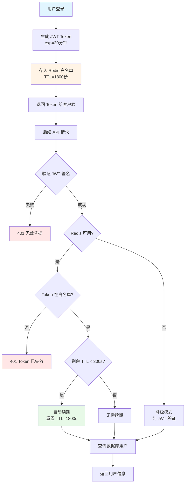

# Token 管理机制详解

## 📋 概述

当前系统使用 **JWT (JSON Web Token) + Redis 白名单** 的双重验证机制来管理用户登录态，实现了安全性和用户体验的平衡。

## 🔑 核心组件

### 1. JWT Token

- **生成库**：`python-jose`
- **算法**：HS256
- **有效期配置**：`config.py` 中的 `ACCESS_TOKEN_EXPIRE_MINUTES`
- **密钥**：`SECRET_KEY` (应在 `.env` 中配置)

### 2. Redis 白名单

- **连接配置**：`REDIS_URL` (默认: `redis://localhost:6379`)
- **作用**：Token 白名单、Token 撤销、自动续期
- **优雅降级**：Redis 不可用时自动降级为纯 JWT 模式

---

## ⏰ Token 有效时间控制

### 配置位置：`backend/app/config.py`

```python
class Settings(BaseSettings):
    # JWT配置
    SECRET_KEY: str = "your-secret-key-here"
    ALGORITHM: str = "HS256"
    ACCESS_TOKEN_EXPIRE_MINUTES: int = 30  # Token 基础有效期：30分钟
    TOKEN_RENEW_THRESHOLD_MINUTES: int = 5  # 自动续期阈值：剩余5分钟时触发
```

### 三个关键时间参数

| 参数                            | 默认值            | 说明                          |
| ------------------------------- | ----------------- | ----------------------------- |
| `ACCESS_TOKEN_EXPIRE_MINUTES`   | 30                | Token 的初始有效期            |
| `TOKEN_RENEW_THRESHOLD_MINUTES` | 5                 | 触发自动续期的剩余时间阈值    |
| Redis TTL                       | 30 \* 60 = 1800秒 | Redis 中 Token 的实际过期时间 |

---

## 🔄 Token 生命周期

### 1. Token 生成（登录时）

**位置**：`backend/app/utils/security.py`

```python
def create_access_token(data: dict, expires_delta: Optional[timedelta] = None):
    """创建访问令牌"""
    to_encode = data.copy()
    if expires_delta:
        expire = datetime.utcnow() + expires_delta
    else:
        expire = datetime.utcnow() + timedelta(minutes=settings.ACCESS_TOKEN_EXPIRE_MINUTES)

    to_encode.update({"exp": expire})  # JWT 标准过期时间字段
    encoded_jwt = jwt.encode(to_encode, settings.SECRET_KEY, algorithm=settings.ALGORITHM)
    return encoded_jwt
```

**调用流程**：

```
用户登录 → AuthService.login() → create_access_token({"sub": user.id})
        ↓
生成 JWT Token (30分钟有效期)
        ↓
token_manager.store_token() → 存入 Redis (1800秒 TTL)
```

---

### 2. Token 存储到 Redis

**位置**：`backend/app/utils/token_manager.py`

```python
@classmethod
def store_token(cls, token: str, user_id: str, username: str, role: str) -> bool:
    """存储 token 到 Redis"""
    expire = cls.TOKEN_EXPIRE_SECONDS  # 30 * 60 = 1800秒
    now = datetime.utcnow()

    # Token 数据结构
    token_data = {
        "user_id": user_id,
        "username": username,
        "role": role,
        "created_at": now.isoformat(),
        "last_active": now.isoformat(),
        "expire_at": (now + timedelta(seconds=expire)).isoformat()
    }

    # 存储到 Redis
    token_key = f"token:{token_hash}"  # token_hash = SHA256(token)[:16]
    redis_client.set(token_key, token_data, expire)  # 设置 1800秒 TTL

    # 用户 -> Token 映射（用于单点登录）
    user_token_key = f"user_token:{user_id}"
    redis_client.set(user_token_key, token_hash, expire)
```

**Redis 数据结构**：

```
Key: token:abc123def456     (Token 白名单)
Value: {
  "user_id": "user1",
  "username": "admin",
  "role": "admin",
  "created_at": "2025-01-01T10:00:00",
  "last_active": "2025-01-01T10:15:00",
  "expire_at": "2025-01-01T10:30:00"
}
TTL: 1800秒

Key: user_token:user1       (用户 Token 映射，用于单点登出)
Value: abc123def456
TTL: 1800秒
```

---

### 3. Token 验证（每次请求）

**位置**：`backend/app/utils/security.py`

```python
def get_current_user(credentials: HTTPAuthorizationCredentials = Depends(security), db: Session = Depends(get_db)) -> User:
    """获取当前用户（支持 Redis Token 白名单和自动续期）"""

    token = credentials.credentials

    # 第一步：验证 JWT 签名和有效期
    user_id = verify_token(token)
    if user_id is None:
        raise HTTPException(status_code=401, detail="无效的认证凭据")

    # 第二步：检查 Redis 白名单（如果 Redis 可用）
    if redis_connected:
        token_data = token_manager.verify_token(token)
        if token_data is None:
            raise HTTPException(status_code=401, detail="Token 已失效，请重新登录")

        # 第三步：自动续期 Token（滑动窗口）
        token_manager.renew_token(token)
    else:
        # Redis 不可用，降级为纯 JWT 模式
        logger.warning("⚠️ Redis 未连接，降级为纯 JWT 模式")

    # 第四步：从数据库查询用户
    user = db.query(User).filter(User.id == user_id).first()
    return user
```

**验证流程**：

```
每次 API 请求
    ↓
解析 Authorization Header
    ↓
验证 JWT 签名和有效期 (jose.jwt.decode)
    ↓
检查 Redis 白名单 (token_manager.verify_token)
    ↓
自动续期检查 (token_manager.renew_token)
    ↓
查询数据库用户信息
    ↓
返回 User 对象
```

---

### 4. Token 自动续期（滑动窗口）

**位置**：`backend/app/utils/token_manager.py`

```python
@classmethod
def renew_token(cls, token: str) -> bool:
    """续期 token（滑动窗口机制）"""
    token_key = cls._get_token_key(token)

    # 获取当前 TTL
    current_ttl = redis_client.ttl(token_key)

    # 如果剩余时间少于阈值（5分钟 = 300秒），则续期
    if 0 < current_ttl < cls.TOKEN_RENEW_THRESHOLD:  # 300秒
        # 更新 last_active 时间
        token_data = redis_client.get(token_key)
        token_data['last_active'] = datetime.utcnow().isoformat()

        # 重新设置 TTL 为 1800秒
        redis_client.set(token_key, token_data, cls.TOKEN_EXPIRE_SECONDS)

        # 同时续期用户 token 映射
        user_token_key = cls._get_user_token_key(user_id)
        redis_client.expire(user_token_key, cls.TOKEN_EXPIRE_SECONDS)

        logger.info(f"🔄 Token 已续期 - NewTTL: 1800s")
        return True

    return True  # 剩余时间充足，无需续期
```

**续期逻辑图**：

```
用户活跃操作（API 请求）
    ↓
检查 Token 剩余 TTL
    ↓
TTL < 300秒？
    ├─ 是 → 重置 TTL 为 1800秒 ✅
    └─ 否 → 无需续期 ⏳
```

**示例时间线**：

```
10:00 - 登录，Token TTL = 1800秒 (过期时间: 10:30)
10:15 - 用户操作，TTL = 900秒 (剩余15分钟，无需续期)
10:26 - 用户操作，TTL = 240秒 (剩余4分钟 < 5分钟) → 触发续期
      → 新 TTL = 1800秒 (新过期时间: 10:56)
10:40 - 用户操作，TTL = 960秒 (剩余16分钟，无需续期)
10:52 - 用户操作，TTL = 240秒 → 再次触发续期
      → 新 TTL = 1800秒 (新过期时间: 11:22)
```

---

## 🛡️ Redis 的三大作用

### 1. **Token 白名单（安全性）**

**问题**：纯 JWT 无法在服务端主动撤销 Token

**解决**：

- 所有有效 Token 存储在 Redis 中
- 每次请求先检查 Redis 白名单
- 不在白名单中的 Token 无法通过验证

**场景**：

- ✅ 用户主动登出 → 从 Redis 删除 Token
- ✅ 管理员禁用用户 → 删除该用户所有 Token
- ✅ 密码修改 → 强制所有设备重新登录
- ✅ 检测到异常登录 → 立即撤销 Token

### 2. **Token 自动续期（用户体验）**

**问题**：JWT 固定 30 分钟过期，用户经常需要重新登录

**解决**：

- 监听用户活跃度（API 请求）
- 剩余时间 < 5 分钟时自动续期
- 用户保持活跃则 Token 永不过期

**优势**：

- ✅ 用户无感知自动续期
- ✅ 长时间不活跃自动登出（安全性）
- ✅ 活跃用户无需频繁登录（体验）

### 3. **单点登录控制（一致性）**

**问题**：同一用户多设备登录，如何管理

**解决**：

- 维护 `user_token:{user_id}` 映射
- 记录用户当前有效的 Token
- 可实现强制单点登录（可选）

**扩展能力**：

- ✅ 查询用户当前登录设备
- ✅ 强制单点登录（踢出其他设备）
- ✅ 查看用户最后活跃时间

---

## 🔧 Redis 不可用时的降级策略

### 优雅降级机制

```python
# backend/app/utils/security.py
redis_connected = redis_client.is_connected()

if redis_connected:
    # 完整功能：JWT + Redis 白名单 + 自动续期
    token_data = token_manager.verify_token(token)
    if token_data is None:
        raise HTTPException(status_code=401)
    token_manager.renew_token(token)
else:
    # 降级模式：仅验证 JWT 签名和有效期
    logger.warning("⚠️ Redis 未连接，降级为纯 JWT 模式")
    # 此时 Token 固定 30 分钟有效期，无法撤销，无法续期
```

### 降级模式对比

| 功能         | 完整模式 (Redis 可用) | 降级模式 (Redis 不可用) |
| ------------ | --------------------- | ----------------------- |
| JWT 验证     | ✅                    | ✅                      |
| Token 有效期 | 30分钟 + 自动续期     | 固定30分钟              |
| Token 撤销   | ✅ 支持               | ❌ 不支持               |
| 自动续期     | ✅ 支持               | ❌ 不支持               |
| 强制登出     | ✅ 支持               | ❌ 不支持               |
| 用户体验     | 🌟🌟🌟🌟🌟            | 🌟🌟🌟                  |
| 安全性       | 🌟🌟🌟🌟🌟            | 🌟🌟🌟                  |

---

## 📊 完整流程图



---

## 🎯 配置建议

### 开发环境

```python
ACCESS_TOKEN_EXPIRE_MINUTES = 60  # 1小时，方便开发调试
TOKEN_RENEW_THRESHOLD_MINUTES = 10  # 剩余10分钟续期
```

### 生产环境

```python
ACCESS_TOKEN_EXPIRE_MINUTES = 30  # 30分钟，平衡安全和体验
TOKEN_RENEW_THRESHOLD_MINUTES = 5  # 剩余5分钟续期
```

### 高安全场景（金融、医疗）

```python
ACCESS_TOKEN_EXPIRE_MINUTES = 15  # 15分钟
TOKEN_RENEW_THRESHOLD_MINUTES = 3  # 剩余3分钟续期
# 并启用强制单点登录
```

---

## 🛠️ 维护操作

### 1. 查看用户 Token 信息

```python
from app.utils.token_manager import token_manager

# 获取 Token 详细信息（包括 TTL）
token_info = token_manager.get_token_info(token)
print(token_info)
# {
#   "user_id": "user1",
#   "username": "admin",
#   "role": "admin",
#   "created_at": "2025-01-01T10:00:00",
#   "last_active": "2025-01-01T10:15:00",
#   "expire_at": "2025-01-01T10:30:00",
#   "ttl": 600  # 剩余600秒
# }
```

### 2. 强制用户登出

```python
# 撤销单个 Token
token_manager.revoke_token(token)

# 撤销用户所有 Token（所有设备）
token_manager.revoke_user_tokens(user_id)
```

### 3. 监控 Redis Token

```bash
# 查看所有 Token
redis-cli KEYS "token:*"

# 查看特定用户的 Token
redis-cli GET "user_token:user1"

# 查看 Token TTL
redis-cli TTL "token:abc123def456"
```

---

## 💡 常见问题

### Q1: 为什么 Token 有两个过期时间？

**A**:

- JWT 自身的 `exp` 字段（30分钟）：防止 Token 被窃取后长期使用
- Redis 的 TTL（1800秒）：实现服务端控制和自动续期

两者配合使用，Redis TTL 是实际生效的时间。

### Q2: 如果 Redis 宕机了怎么办？

**A**: 系统会自动降级为纯 JWT 模式：

- ✅ 用户仍可正常使用（30分钟内）
- ❌ 失去 Token 撤销能力
- ❌ 失去自动续期能力

Redis 恢复后，新登录的用户自动恢复完整功能。

### Q3: Token 续期会更新前端的 Token 吗？

**A**: 不会。续期是在 Redis 后端进行的，前端 Token 不变。这是**静默续期**机制，用户无感知。

### Q4: 如何实现强制单点登录（踢出其他设备）？

**A**: 修改 `store_token` 逻辑：

```python
# 登录时先撤销旧 Token
token_manager.revoke_user_tokens(user_id)
# 再存储新 Token
token_manager.store_token(new_token, ...)
```

---

## 📝 总结

当前系统采用 **JWT + Redis 双重验证 + 滑动窗口续期** 的机制：

1. **JWT 负责**：无状态认证、基础有效期（30分钟）
2. **Redis 负责**：Token 白名单、撤销控制、自动续期（滑动窗口）
3. **滑动窗口**：用户保持活跃则 Token 自动续期，体验更好
4. **优雅降级**：Redis 不可用时降级为纯 JWT 模式，保证系统可用性

这种设计在 **安全性**、**用户体验**、**系统可靠性** 之间取得了很好的平衡。
